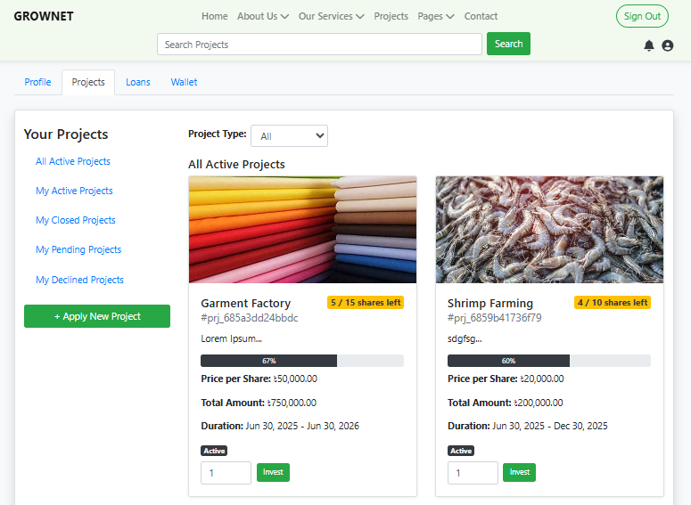

# 🌿 GrowNet - Micro Investment Platform

[](https://opensource.org/licenses/MIT)
[](https://github.com/rubaiyat07/grownet/commits/main)

**Live Demo:** [grownet.rubyz.xyz](https://grownet.rubyz.xyz)

GrowNet is a web-based micro-investment platform that connects investors with small businesses and startups through share-based crowdfunding and micro-loans.



## ✨ Features

- **For Investors**:
  - Browse vetted investment opportunities
  - Invest in projects by purchasing shares
  - Track investment portfolio performance
  - Secure wallet system for funds

- **For Entrepreneurs**:
  - Create and list projects to raise capital
  - Set share price and total shares available
  - Apply for business loans
  - Manage investor relations

- **For All Users**:
  - Secure authentication system
  - Profile management with document upload
  - Transaction history tracking


## 🛠️ Technologies Used

- **Frontend**: Bootstrap 4, JavaScript, jQuery, Chart.js
- **Backend**: PHP, MySQL, PDO
- **Database**: MariaDB/MySQL
- **Hosting**: Apache/Nginx
- **Other**: AJAX, Font Awesome, jQuery plugins

## 📦 Database Schema

Key tables:
- `users` - User accounts and profiles
- `projects` - Investment opportunities
- `loans` - Loan applications
- `share_orders` - Investment records
- `balance_transactions` - Financial transactions

## 🚀 Installation

1. Clone the repository:
   ```bash
   git clone https://github.com/rubaiyat07/grownet.git
   cd grownet

## 📂 Project Structure
grownet/

├── assets/            # Static assets (CSS, JS, images)

├── config/            # Configuration files

├── admin/             # Admin panel (not included in this repo)

├── includes/          # Reusable components

├── pages/             # Main application pages

├── index.php          # Main entry point

└── README.md          # This file

🤝 Contributing
Contributions are welcome! Please follow these steps:

Fork the project

Create your feature branch (git checkout -b feature/AmazingFeature)

Commit your changes (git commit -m 'Add some AmazingFeature')

Push to the branch (git push origin feature/AmazingFeature)

Open a Pull Request


## 📜 License  
This project is licensed under the [MIT License](LICENSE).  